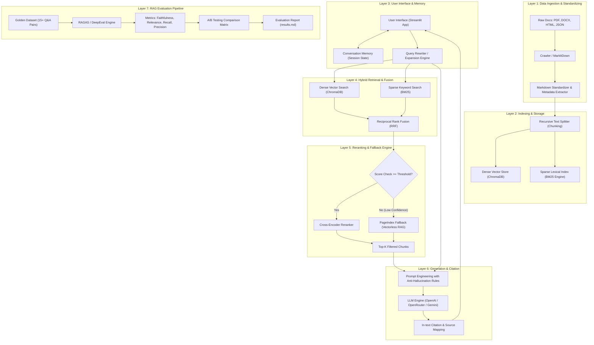

# TÀI LIỆU KIẾN TRÚC HỆ THỐNG (SYSTEM ARCHITECTURE SPECIFICATION)
## Dự Án: E-Commerce Support RAG Chatbot & Evaluation Pipeline

---

## 1. TỔNG QUAN KIẾN TRÚC (ARCHITECTURE OVERVIEW)

Hệ thống được thiết kế theo **Kiến trúc Phân tầng Độc lập (Modular Layered Architecture)**, chia làm **7 Phân hệ Chính (Subsystems)** giúp đảm bảo tính linh hoạt, dễ mở rộng, tối ưu tốc độ truy xuất và đạt độ chính xác cao nhất cho bài toán trợ lý TMĐT.



---

## 2. CHI TIẾT 7 TẦNG KIẾN TRÚC (DETAILED SUBSYSTEM SPECIFICATIONS)

### 🧩 TẦNG 1: XỬ LÝ & CHUẨN HÓA DỮ LIỆU (DATA INGESTION & STANDARDIZING LAYER)
- **Chức năng:** Nạp tài liệu đa định dạng từ các chính sách sàn TMĐT (Shopee, Lazada, Tiki...), chuyển đổi thành cấu trúc thống nhất.
- **Thành phần:**
  - `crawl4ai`: Crawl dữ liệu các trang hỗ trợ khách hàng, điều khoản người bán/người mua từ URL.
  - `markitdown[pdf]` & `fpdf2`: Trích xuất nội dung văn bản pháp lý dạng PDF/DOCX.
  - `metadata_extractor`: Gán thẻ thông tin мета (source_name, doc_type, category, version, date) vào từng văn bản.
- **Đầu ra:** Các file `.md` chuẩn hóa tại thư mục `data/standardized/`.

---

### 🧩 TẦNG 2: LƯU TRỮ VÀ ĐÁNH CHỈ SỐ (INDEXING & STORAGE LAYER)
- **Chức năng:** Phân đoạn tài liệu và xây dựng chỉ số kép (Hybrid Indexing).
- **Thành phần:**
  - **Chunking Engine:** Sử dụng `RecursiveCharacterTextSplitter` với quy tắc phân đoạn ngữ pháp (Header -> Paragraph -> Sentence). 
    - *Chunk size:* 500 - 800 ký tự.
    - *Overlap:* 100 ký tự (tránh đứt gãy thông tin liên kết).
  - **Dense Vector Store (ChromaDB):** 
    - *Embedding Model:* `sentence-transformers/all-MiniLM-L6-v2` (chạy local 384 dimensions, không phụ thuộc API key).
    - Lưu trữ vĩnh viễn (Persistent Client) tại `data/chroma_db/`.
  - **Sparse Lexical Index (BM25):** 
    - Sử dụng `rank-bm25` tính toán tần suất từ khóa chính xác (Keyword Matching) phục vụ tra cứu số hiệu điều khoản, tên viết tắt.

---

### 🧩 TẦNG 3: GIAO DIỆN & QUẢN LÝ NGỮ CẢNH (UI & CONVERSATION MEMORY LAYER)
- **Chức năng:** Tương tác người dùng và duy trì lịch sử hội thoại nhiều lượt.
- **Thành phần:**
  - **Streamlit Frontend (`app.py`):** Thiết kế giao diện Chatbot chuyên nghiệp với `st.chat_message`, thanh công cụ Sidebar cấu hình tham số.
  - **Conversation Memory (`st.session_state.messages`):** Lưu trữ tối đa 10 lượt hội thoại gần nhất.
  - **Query Expansion / Rewriting (`src/task09_query_expansion.py`):** Dùng LLM hoặc Quy tắc chuyển đổi các câu hỏi nối tiếp (VD: *"Nó có mất phí không?"* -> *"Đổi trả hàng trên Shopee có mất phí vận chuyển không?"*) trước khi gửi vào Retriever.

---

### 🧩 TẦNG 4: TÌM KIẾM HỖN HỢP & DUNG HỢP (HYBRID RETRIEVAL & FUSION LAYER)
- **Chức năng:** Tìm kiếm đồng thời theo ngữ nghĩa (Semantic) và từ khóa (Lexical), sau đó tổng hợp kết quả.
- **Thành phần:**
  - **Parallel Search Execution:** Gửi Query đến đồng thời ChromaDB Vector Search (Top-20) và BM25 Search (Top-20).
  - **Reciprocal Rank Fusion (RRF Algorithm):**
    $$RRF\_Score(d) = \sum_{m \in M} \frac{1}{k + r_m(d)}$$
    *(Trong đó $k=60$, $r_m(d)$ là thứ hạng tài liệu trong từng phương pháp tìm kiếm).*
  - **Convex Weighting ($\alpha$ Slider):**
    $$Combined\_Score = \alpha \cdot Dense\_Score + (1 - \alpha) \cdot Sparse\_Score$$
    *(Cho phép điều chỉnh độ ưu tiên qua Slider trên Sidebar UI).*

---

### 🧩 TẦNG 5: TÁI XẾP HẠNG VÀ CƠ CHẾ DỰ PHÒNG (RERANKING & FALLBACK ENGINE)
- **Chức năng:** Tinh chỉnh độ chính xác của ngữ cảnh và xử lý các câu hỏi phức tạp/nằm ngoài index vector.
- **Thành phần:**
  - **Cross-Encoder Reranker (`sentence-transformers/ms-marco-MiniLM-L-6-v2`):** Tính toán điểm tương quan chi tiết giữa Query và Top Chunks thu được từ RRF, chọn ra Top-K (VD: Top-5) chất lượng nhất.
  - **Confidence Evaluator:** Tính toán điểm số tin cậy trung bình của Top Chunks.
  - **PageIndex Fallback (Vectorless RAG - Task 8):** Nếu Confidence Score $< \tau$ (Ví dụ: $< 0.35$), hệ thống tự động fallback sang tra cứu theo cây chỉ mục phân cấp PageIndex để duyệt toàn văn bản thay vì tìm kiếm đoạn cắt nhỏ.

---

### 🧩 TẦNG 6: SINH CÂU TRẢ LỜI CÓ TRÍCH DẪN (GENERATION & CITATION ENGINE)
- **Chức năng:** Tổng hợp thông tin từ Context và sinh phản hồi tự nhiên, chống bịa đặt (Anti-hallucination).
- **Thành phần:**
  - **Prompt Engineering (`src/task10_generation.py`):**
    - Ràng buộc nghiêm ngặt: *"Chỉ trả lời dựa trên Context được cung cấp. Nếu không tìm thấy thông tin, hãy lịch sự thông báo không có thông tin trong quy định."*
    - Định dạng trích dẫn: Thêm mốc đánh dấu `[Nguồn: Tên_Văn_Bản, Mục X]` ngay sau từng ý phát biểu.
  - **Multi-Provider LLM Wrapper:** 
    - Lựa chọn linh hoạt LLM: OpenAI (`gpt-4o-mini` / `gpt-3.5-turbo`), OpenRouter (`google/gemini-2.0-flash-exp:free`), Google Gemini API.
    - Cơ chế Tự động Chuyển đổi (Automatic Failover) khi gặp lỗi Rate Limit (429).
  - **Source Card Renderer:** Hiển thị trực quan nội dung gốc, score và vị trí đoạn trích dưới dạng Expander Card trên Streamlit.

---

### 🧩 TẦNG 7: TỰ ĐỘNG HÓA ĐÁNH GIÁ RAG (EVALUATION PIPELINE LAYER)
- **Chức năng:** Kiểm thử định lượng chất lượng RAG Pipeline trên bộ **Golden Dataset (≥15 Q&A pairs)**.
- **Thành phần:**
  - **Golden Dataset Loader (`group_project/evaluation/golden_dataset.json`):** Quản lý tập dữ liệu câu hỏi chuẩn kèm Ground Truth & Expected Context.
  - **Metrics Evaluator (RAGAS / DeepEval):**
    1. *Faithfulness:* Tỉ lệ các tuyên bố trong câu trả lời có trong Context.
    2. *Answer Relevancy:* Tỉ lệ tương quan giữa câu trả lời và câu hỏi ban đầu.
    3. *Context Recall:* Tỉ lệ thông tin Ground Truth có mặt trong Context thu thập được.
    4. *Context Precision:* Tỉ lệ các đoạn Context có ích được đưa lên đầu danh sách retrieval.
  - **A/B Testing Runner (`group_project/evaluation/eval_pipeline.py`):**
    - Chạy song song **Config A (Dense-Only Baseline)** và **Config B (Hybrid + Cross-Encoder Rerank)**.
  - **Report Builder (`group_project/evaluation/results.md`):** Tự động xuất bảng điểm so sánh, thống kê danh sách câu hỏi điểm thấp (*Worst Performers*) và gợi ý hướng tối ưu.

---

## 3. SƠ ĐỒ LUỒNG DỮ LIỆU (DATA FLOW & SEQUENCE DIAGRAM)

### 3.1. Luồng Tương Tác Hỏi Đáp (Chat Session Flow)

```mermaid
sequenceDiagram
    autonumber
    actor User as Người Dùng
    participant UI as Streamlit UI
    participant Mem as Memory Manager
    participant Hybrid as Hybrid Retriever (Chroma+BM25)
    participant Rerank as Cross-Encoder Reranker
    participant LLM as Generator (LLM)

    User->>UI: Nhập câu hỏi (VD: "Quy định đổi trả thế nào?")
    UI->>Mem: Lấy lịch sử 3 lượt hội thoại gần nhất
    Mem-->>UI: Lịch sử tin nhắn
    UI->>Hybrid: Gửi Query (đã Rewrite nếu cần)
    Parallel
        Hybrid->>Hybrid: ChromaDB Dense Search (Top 20)
        Hybrid->>Hybrid: BM25 Lexical Search (Top 20)
    end
    Hybrid->>Hybrid: Tính toán Reciprocal Rank Fusion (RRF)
    Hybrid-->>Rerank: Top 10 Candidate Chunks
    Rerank->>Rerank: Re-score với Cross-Encoder
    Rerank-->>LLM: Top 5 Filtered Chunks + Query + Memory
    LLM->>LLM: Prompt Engineering & Check Citation
    LLM-->>UI: Trả về Answer + List[Citations]
    UI->>User: Hiển thị câu trả lời & Source Expanders
    UI->>Mem: Cập nhật câu hỏi và câu trả lời vào State
```

---

## 4. TỐI ƯU HIỆU NĂNG VÀ TÍNH SẴN SÀNG (PERFORMANCE & SCALABILITY)

1. **Bộ Nhớ Đệm Model (`@st.cache_resource`):**
   - Chỉ nạp Embeddings Model, Cross-Encoder Reranker và ChromaDB Client **một lần duy nhất** khi khởi tạo ứng dụng, giúp tiết kiệm RAM và giảm latency truy vấn xuống $< 1.5$ giây.
2. **Xử Lý Lỗi Và Chống Bị Khóa API (Failover Strategy):**
   - Tự động chuyển đổi giữa OpenRouter Free Models và OpenAI Key backup khi xảy ra HTTP 429 Rate Limit.
   - Embeddings mặc định chạy hoàn toàn **Local (Sentence-Transformers)** không tốn tài nguyên API key.
3. **Cấu Trúc Mã Nguồn Chuẩn Hóa:**
   - Mã nguồn được tách biệt hoàn toàn giữa Core Logic (`src/`), Interface (`app.py`), và Evaluation (`group_project/evaluation/`).

---

## 5. TỔNG KẾT DANH MỤC FILE TRONG KIẾN TRÚC

| Đường Dẫn File | Vai Trò Trong Kiến Trúc | Phân Hệ Liên Quan |
|:---|:---|:---|
| `Requirement.md` | Bản tả chi tiết toàn bộ Yêu cầu dự án | Tầng 1 - 7 |
| `Architecture.md` | Bản thiết kế kiến trúc hệ thống chi tiết | Tầng 1 - 7 |
| `app.py` | Giao diện Chatbot Streamlit chính | Tầng 3, 4, 5, 6 |
| `src/task01_crawling.py` -> `task10_generation.py` | Các module xử lý RAG Core từ Task 1 - 10 | Tầng 1, 2, 4, 5, 6 |
| `group_project/evaluation/golden_dataset.json` | Bộ dữ liệu đánh giá 15+ Q&A | Tầng 7 |
| `group_project/evaluation/eval_pipeline.py` | Script tự động chạy RAGAS/DeepEval & A/B Testing | Tầng 7 |
| `group_project/evaluation/results.md` | Báo cáo chi tiết kết quả đánh giá | Tầng 7 |
