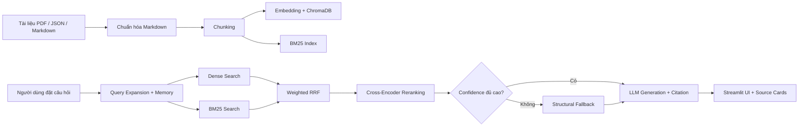

# Tài liệu kỹ thuật — E-commerce Support RAG Chatbot

## 1. Dự án giải quyết vấn đề gì?

Dự án xây dựng chatbot hỏi đáp về chính sách thương mại điện tử, tập trung vào các nội dung như thanh toán, trả hàng/hoàn tiền, vận chuyển và quy định người bán.

Thay vì để mô hình ngôn ngữ trả lời theo kiến thức tổng quát và có nguy cơ bịa thông tin, hệ thống dùng **RAG (Retrieval-Augmented Generation)**: tìm các đoạn tài liệu liên quan trước, sau đó chỉ dùng các đoạn đó để tạo câu trả lời có trích dẫn nguồn.

Các vấn đề chính cần xử lý:

| Vấn đề | Cách giải quyết trong dự án |
|---|---|
| Tài liệu có nhiều định dạng | Chuẩn hóa PDF/DOCX/JSON/Markdown thành Markdown. |
| Câu hỏi diễn đạt đa dạng | Dùng semantic search bằng embedding. |
| Câu hỏi chứa thuật ngữ/số liệu chính xác | Dùng BM25 lexical search. |
| Một retriever đơn lẻ có thể bỏ sót kết quả | Kết hợp Dense + BM25 bằng Weighted RRF. |
| Kết quả đầu vào LLM có thể nhiễu | Dùng Cross-Encoder reranking. |
| Câu hỏi nối tiếp phụ thuộc ngữ cảnh | Query Expansion dựa vào lịch sử chat. |
| Nguy cơ hallucination | Prompt ràng buộc context và citation theo từng nguồn. |

---

## 2. Luồng xử lý tổng thể



---

## 3. Dữ liệu và chuẩn hóa

### Nguồn dữ liệu

- Văn bản chính sách ở `data/landing/legal/`.
- Bài hướng dẫn/hỗ trợ khách hàng ở `data/landing/news/`.
- Dữ liệu sau chuẩn hóa được lưu tại `data/standardized/`.

### Chuẩn hóa Markdown

Module `src/task3_convert_markdown.py` sử dụng **MarkItDown** để chuyển PDF/DOCX sang Markdown. Với bài viết JSON, hệ thống giữ lại các metadata quan trọng như:

- `title`
- `url`
- `date_crawled`
- `source_file`
- `doc_type`
- `category`

Khi nạp tài liệu, pipeline bổ sung metadata phục vụ retrieval và citation:

- `source`, `relative_path`, `type`, `title`
- `url`, `category`, `version`, `date`
- `customer_role` (`buyer`, `seller`, hoặc `both`)
- `chunk_index`, `section`

---

## 4. Chunking

**Kỹ thuật:** `RecursiveCharacterTextSplitter`.

| Tham số | Giá trị | Lý do chọn |
|---|---:|---|
| `chunk_size` | 800 ký tự | Một chunk đủ chứa một ý chính/chính sách nhưng vẫn gọn cho retrieval và LLM context. |
| `chunk_overlap` | 100 ký tự | Giữ lại thông tin ở ranh giới giữa hai chunk, giảm nguy cơ tách rời điều kiện và ngoại lệ. |
| Thứ tự separator | Heading → đoạn → dòng → câu → từ | Ưu tiên giữ cấu trúc Markdown và ý nghĩa văn bản. |

Mỗi chunk giữ lại section heading gần nhất. Nhờ đó UI và citation có thể hiển thị dạng:

```text
[Nguồn: tra_hang_hoan_tien.md, Mục: Thời hạn gửi yêu cầu]
```

---

## 5. Embedding và Dense Retrieval

### Embedding model

Hệ thống sử dụng:

```text
sentence-transformers/all-MiniLM-L6-v2
```

| Thuộc tính | Giá trị |
|---|---|
| Số chiều vector | 384 |
| Cách chạy | Local, không cần API key |
| Chuẩn hóa vector | L2-normalized |
| Vector database | ChromaDB persistent |
| Kho lưu trữ | `chroma_db/` |
| Similarity | Cosine similarity |

### Vì sao dùng embedding?

Dense retrieval tìm được ý nghĩa gần nhau dù cách diễn đạt khác nhau. Ví dụ câu hỏi “đổi trả hàng trong bao lâu?” vẫn có thể tìm tới đoạn “thời hạn gửi yêu cầu trả hàng/hoàn tiền” dù không trùng hoàn toàn từng từ.

Pipeline lấy tối đa **20 dense candidates** trước khi fusion.

---

## 6. Lexical Retrieval với BM25

BM25 là lexical search, phù hợp với những truy vấn cần khớp từ khóa chính xác như:

- số ngày: `15 ngày`, `3–7 ngày`;
- tên chính sách;
- thuật ngữ như `ShopeePay`, `COD`, `Sao Quả Tạ`;
- mã/số hiệu/quy định cụ thể.

Tokenizer hiện dùng regex hỗ trợ tiếng Việt:

```python
re.findall(r"[\wÀ-ỹ]+", text.lower(), flags=re.UNICODE)
```

BM25 trả tối đa **20 sparse candidates** có điểm dương. Đây là điểm khác với dense retrieval: BM25 ưu tiên xuất hiện từ khóa, còn embedding ưu tiên tương đồng ngữ nghĩa.

---

## 7. Hybrid Retrieval và Weighted RRF

Hai retriever chạy song song bằng `ThreadPoolExecutor`:

1. Dense search từ ChromaDB.
2. BM25 lexical search.

Kết quả được gộp bằng **Weighted Reciprocal Rank Fusion (RRF)**:

\[
\operatorname{RRF}(d) = \sum_i \frac{w_i}{k + rank_i(d)}
\]

Trong đó:

- `k = 60` giúp tránh một kết quả đứng đầu tuyệt đối lấn át các kết quả khác.
- `w_i` là trọng số từng retriever.
- Sidebar Streamlit có slider `α` để điều chỉnh ưu tiên Dense Search và BM25.
- Mặc định `α = 0.5`, tức hai retriever có trọng số như nhau.

Lý do dùng RRF: điểm Dense cosine và điểm BM25 không cùng thang đo, nên cộng trực tiếp sẽ không đáng tin cậy. RRF chỉ dựa vào thứ hạng, vì vậy phù hợp để fusion nhiều retriever.

---

## 8. Reranking

Sau RRF, các candidates được xếp hạng lại bằng Cross-Encoder:

```text
cross-encoder/ms-marco-MiniLM-L-6-v2
```

Cross-Encoder nhận đồng thời cặp `(query, chunk)` và đánh giá mức liên quan chi tiết hơn embedding bi-encoder. Hệ thống lấy Top-K chunks sau reranking để đưa vào LLM.

Nếu model không tải được, pipeline không dừng hoàn toàn mà giữ lại thứ hạng RRF làm phương án dự phòng.

### Ý nghĩa các loại score trên giao diện

Các retriever không dùng cùng một thang điểm, nên UI hiển thị rõ loại score thay vì gọi chung là `score`:

| Nhãn UI | Thang đo | Ý nghĩa |
|---|---|---|
| `CE relevance` | 0–100% | Raw Cross-Encoder logit được sigmoid-normalize để dễ đọc; dùng để so thứ hạng trong cùng một query, không phải xác suất tuyệt đối. |
| `Dense cosine` | 0–100% | Cosine similarity của embedding, dùng cho confidence/fallback threshold. |
| `RRF rank` | số nhỏ | Điểm fusion dựa trên vị trí xếp hạng, không phải phần trăm. |
| `BM25 raw` | số dương | Điểm khớp từ khóa, chỉ so sánh trong cùng một query. |
| `Keyword coverage` | 0–100% | Mức độ chồng lấp từ khóa của structural fallback. |

Ví dụ raw logit Cross-Encoder `6.7523` được UI hiển thị là `CE relevance: 99.9%`, đồng thời phần chi tiết vẫn giữ raw logit, Dense cosine và RRF rank để kiểm tra.

---

## 9. Confidence và Structural Fallback

Pipeline tính confidence từ trung bình dense cosine score của các candidates cuối. Ngưỡng mặc định là `0.35`.

Nếu confidence thấp hoặc hybrid retrieval không có kết quả, hệ thống dùng fallback vectorless cục bộ trong `src/task8_pageindex_vectorless.py`:

- Duyệt toàn bộ Markdown theo cấu trúc heading/section.
- Tính mức độ chồng lấp từ khóa giữa query và từng section.
- Trả về các section khớp nhất cùng thông tin source và section.

Fallback này hoạt động local, không cần gửi tài liệu sang dịch vụ bên ngoài. Nó được đặt tên theo vai trò “PageIndex fallback”, nhưng hiện không phải tích hợp PageIndex cloud SDK.

---

## 10. Query Expansion và Conversation Memory

### Conversation Memory

`st.session_state.messages` lưu tối đa **20 messages**, tương đương **10 lượt hội thoại** gần nhất.

### Query Expansion

Module `src/task09_query_expansion.py` nhận biết các câu hỏi phụ thuộc ngữ cảnh, ví dụ:

```text
Câu trước: “Thời hạn trả hàng là bao lâu?”
Câu sau: “Có mất phí không?”
```

Truy vấn đưa vào retrieval sẽ được mở rộng thành:

```text
Thời hạn trả hàng là bao lâu? — Câu hỏi tiếp theo: Có mất phí không?
```

Cách này cải thiện retrieval mà không bắt buộc dùng thêm LLM/API key.

---

## 11. Generation, Citation và Failover

### Prompt grounding

Prompt bắt buộc LLM:

1. Chỉ trả lời từ context đã cung cấp.
2. Không có bằng chứng thì trả lời không thể xác minh.
3. Gắn citation ngay sau nội dung được khẳng định.
4. Trả lời bằng tiếng Việt.

### Citation

Mỗi chunk được format cùng nhãn citation gồm source và section. Source cards trên Streamlit hiển thị:

- tên tài liệu;
- URL nguồn nếu có;
- score;
- retrieval source (`hybrid` hoặc `pageindex`);
- nội dung chunk.

### LLM failover

Thứ tự provider:

1. Gemini API;
2. OpenRouter;
3. OpenAI.

Nếu không có API key hoặc provider gặp lỗi, hệ thống chuyển sang **extractive fallback**: hiển thị các đoạn bằng chứng liên quan kèm citation thay vì tự tạo thông tin mới.

---

## 12. Evaluation Pipeline

Golden Dataset nằm ở:

```text
group_project/evaluation/golden_dataset.json
```

Hiện có 16 cặp câu hỏi, đáp án mong đợi và expected context.

Evaluation hiện chạy A/B giữa:

| Config | Pipeline |
|---|---|
| A | Dense-only Chroma retrieval |
| B | Dense + BM25 + Weighted RRF + Cross-Encoder + fallback |

Khi cấu hình evaluator API, script dùng **RAGAS 0.1.21** để chạy bốn metric LLM-based:

1. Faithfulness.
2. Answer Relevancy.
3. Context Recall.
4. Context Precision.

Thiết lập evaluator trong `.env`:

```text
RAGAS_EVALUATOR_API_KEY=...
RAGAS_EVALUATOR_MODEL=gpt-4o-mini
RAGAS_EVALUATOR_EMBEDDING_MODEL=text-embedding-3-small
```

Sau đó chạy lệnh strict sau để chỉ chấp nhận kết quả RAGAS thật:

```powershell
python group_project/evaluation/eval_pipeline.py --require-ragas
```

Report tự động xuất bảng so sánh A/B, thay đổi từng metric và 5 **Worst Performers** của Config B, gồm nguyên nhân khả dĩ và đề xuất cải thiện.

Nếu không có evaluator API, chạy không có `--require-ragas` sẽ dùng cosine proxy local để demo không bị dừng. Report sẽ gắn nhãn rõ đó là **offline fallback, không phải điểm RAGAS**.

---

## 13. Cách chạy dự án

```powershell
# Kích hoạt môi trường Python đã cài dependencies
.\.venv\Scripts\Activate.ps1

# Chuẩn hóa dữ liệu và build lại ChromaDB
python -m src.task3_convert_markdown
python -m src.task4_chunking_indexing

# Chạy test
pytest tests/ -v

# Khởi động giao diện
streamlit run app.py

# Chạy evaluation A/B RAGAS thật
python group_project/evaluation/eval_pipeline.py --require-ragas
```

---

## 14. Giới hạn và hướng nâng cấp

| Hiện tại | Hướng nâng cấp |
|---|---|
| `all-MiniLM-L6-v2` nhẹ nhưng không tối ưu cho tiếng Việt | Thử `BAAI/bge-m3` hoặc embedding tiếng Việt chuyên dụng. |
| BM25 cần từ khóa cùng ngôn ngữ | Thêm synonym dictionary/song ngữ hoặc query translation. |
| Fallback là structural local search | Tích hợp PageIndex cloud SDK nếu có yêu cầu sử dụng dịch vụ này. |
| RAGAS cần evaluator API riêng | Dùng `--require-ragas` khi chấm điểm để không nhận metric proxy. |
| LLM có thể trả lời bằng format citation không đúng | Hệ thống đã hậu kiểm source + section; câu trả lời không hợp lệ chuyển sang extractive fallback. |
| Chưa có deployment | Deploy lên Hugging Face Spaces, Render hoặc Streamlit Community Cloud. |

## 15. Kết luận

Hệ thống sử dụng kiến trúc RAG hybrid để kết hợp ưu điểm của semantic search và lexical search. Chunking có overlap giúp giữ ngữ cảnh, embedding + ChromaDB tìm ý nghĩa, BM25 giữ khả năng khớp chính xác, Weighted RRF hợp nhất hai nguồn, và Cross-Encoder tinh chỉnh Top-K context trước khi sinh câu trả lời. Các cơ chế memory, query expansion, fallback và citation giúp chatbot hữu ích hơn cho câu hỏi chính sách thương mại điện tử nhiều lượt.
